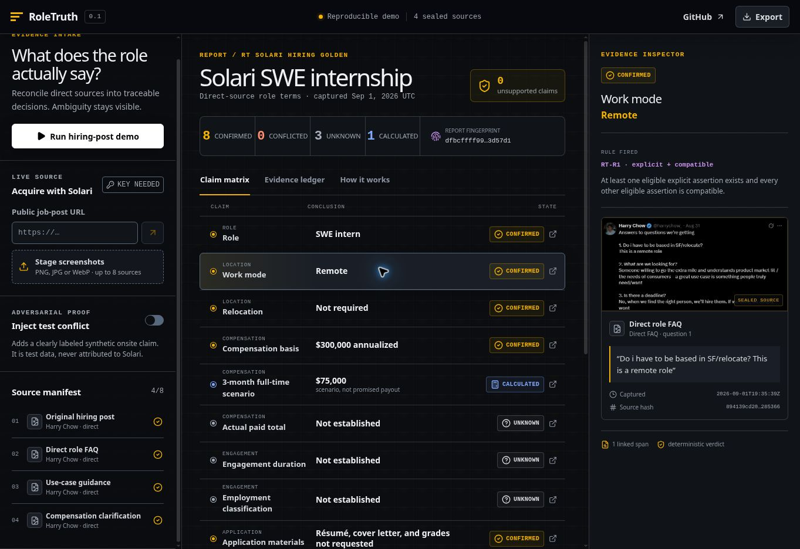
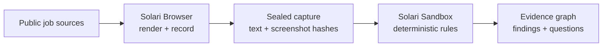

# RoleTruth

[](https://github.com/marcusmayo/roletruth/actions/workflows/ci.yml)
[](LICENSE)
[](https://docs.getsolari.com/)
[](https://codespaces.new/marcusmayo/roletruth)

RoleTruth turns scattered job posts, screenshots, and direct clarifications into
an auditable answer to a narrow question: **what does the role actually say?**

It is not a job summarizer and it does not score candidates. It resolves atomic
role terms as **Confirmed**, **Conflicted**, or **Unknown**, exposes the exact
source span behind every conclusion, and labels derived math so a scenario
cannot masquerade as quoted compensation.

> **No API key is required for the working preview.** A `SOLARI_API_KEY` is
> needed only when acquiring and reconciling a new live source through Solari.



## Judge it in 90 seconds

1. Open the frontend. The reviewed Solari hiring fixture is already loaded.
2. Select **Work mode** and inspect the direct-source quote, capture time, and
   SHA-256 receipt.
3. Select **Actual paid total**. RoleTruth abstains because annualized pay does
   not establish term or full-time equivalency.
4. Select **3-month full-time scenario**. The formula is visible and labeled as
   a scenario—not a promised payout.
5. Turn on **Inject test conflict**. A clearly labeled synthetic onsite claim
   changes only Work mode from Confirmed to Conflicted.
6. Export the evidence JSON or copy the questions that close the remaining gaps.

The keyless path is a real deterministic fixture, not a simulated Solari run.
The interface names the current mode and never silently falls back after a live
failure.

## Golden-fixture results

The built-in evidence is the public hiring material that motivated this build.

| Atomic claim | RoleTruth result | Why |
|---|---|---|
| Role | **Confirmed — SWE intern** | Explicit opening sentence |
| Work mode | **Confirmed — Remote** | Direct FAQ says it is a remote role |
| Relocation | **Confirmed — Not required** | Same direct FAQ answers the SF/relocation question |
| Compensation basis | **Confirmed — $300,000 annualized** | “Annualized” is preserved as the basis |
| 3-month full-time scenario | **Calculated — $75,000** | $300,000 × 3/12 × 1.0 FTE |
| Actual paid total | **Unknown** | Actual duration and FTE are not established |
| Duration | **Unknown** | A conditional three-month example is not the actual term |
| Employment classification | **Unknown** | Employee/contractor and schedule are unstated |
| Application materials | **Confirmed — résumé, cover letter, and grades not requested** | Explicit direct statement |
| Application path | **Confirmed — fork, build, publish, post, tag** | Numbered steps in the hiring post |
| Deadline | **Confirmed — no fixed deadline** | Direct FAQ explicitly answers “No” |
| Evaluation signal | **Confirmed — genuine problem and user demand** | Direct use-case guidance |

The source screenshots, reviewed excerpts, hashes, and capture time are in
[`public/evidence`](public/evidence). The expected behavior is enforced by the
test suite, including the zero-confirmed-without-evidence invariant.

## Why Solari is material

The live path uses two distinct Solari capabilities:

- **Solari Browser** renders each public source, follows the final URL, captures
  body text and a full-page screenshot, records the session, and produces text
  and image SHA-256 receipts.
- **Solari Sandbox** receives the sealed captures and runs the stdlib-only
  deterministic reconciler in an isolated environment. Browser and sandbox
  resources are released in `finally` blocks.



The model or extractor may propose assertions. It cannot assign a verdict.
That division follows the same principle used in Argus/Keel: deterministic code
handles mechanical reconciliation; semantic uncertainty stays visible for human
review.

### Two honest execution modes

| Mode | Credentials | What it proves |
|---|---|---|
| **Reproducible demo** | None | Source manifest, exact reviewed spans, deterministic verdicts, conflict mutation, compensation math, report export |
| **Solari live** | `SOLARI_API_KEY` | Recorded Browser acquisition, rendered-page hashing, isolated Sandbox execution, runtime session and exit receipts |

A live run is never labeled complete unless both Solari stages return their
receipts. Signed replay, CDP, WebSocket, and file capability URLs are not
exported.

## Evidence contract

RoleTruth uses atomic claims rather than forcing broad conclusions.

- **RT-R1 · Confirmed:** at least one eligible explicit assertion exists and
  every other eligible assertion is compatible.
- **RT-R2 · Conflicted:** eligible assertions are materially incompatible.
  Source authority remains visible but cannot erase a contradiction.
- **RT-R3 · Unknown:** no eligible explicit assertion exists, capture failed,
  or wording is ambiguous.
- **RT-C1 · Calculated:** formula, inputs, evidence, and assumptions are visible.

Absence is never negative evidence. A duplicated repost is not independent
corroboration. Annualized compensation and a prorated scenario are separate
facts, not competing numbers.

See [Evidence model](docs/EVIDENCE_MODEL.md) for the entities and normalization
rules.

## Run the visible frontend

### GitHub Codespaces

1. Select **Code → Codespaces → Create codespace on main**, or use the badge at
   the top of this README.
2. Wait for the initial dependency setup. The preview server starts
   automatically whenever the Codespace attaches.
3. Open the automatically forwarded **RoleTruth frontend** on port **3000**.
   If it does not open automatically, select the **Ports** tab, locate port 3000,
   and choose **Open in Browser**.

The golden fixture, evidence inspector, synthetic conflict, calculations, file
staging, questions, and JSON export work without a key.

### Enable a real Solari run

1. Obtain a Solari API key or request sponsored credits from the Solari team.
2. In the repository or Codespaces settings, create a secret named
   `SOLARI_API_KEY`. Do not commit it and do not prefix it with
   `NEXT_PUBLIC_`.
3. Rebuild/restart the Codespace so the server receives the secret.
4. Run `npm run dev:codespaces`, paste a public job URL into **Acquire with
   Solari**, and run it.

For the smallest end-to-end proof without the frontend:

```bash
export SOLARI_API_KEY=slr_live_your_key
npm run roletruth:solari -- https://example.com/job-post
```

The standalone example is in
[`examples/roletruth-solari`](examples/roletruth-solari).

## Verification evidence

| Requirement | Implementation | Automated proof | Visible proof |
|---|---|---|---|
| Deterministic status | `lib/roletruth-engine.ts` | Golden and conflict tests | Claim matrix |
| Exact provenance | Source/evidence/assertion graph | Zero unsupported-claim test | Evidence inspector |
| Compensation integrity | Explicit calculation object | $300K → $75K scenario test | Calculation inspector |
| Safe URL intake | `lib/url-security.ts` | Private/metadata/scheme corpus | Rejected live request |
| Optional live Solari | Browser + Sandbox API route and CLI | Production build + resource cleanup | Live runtime receipt |
| Responsive frontend | Vinext/React working surface | Production worker render test | Desktop/mobile layout |
| Secret boundary | Server-only `SOLARI_API_KEY` | No `NEXT_PUBLIC_` secret path | Key-needed state |

Run the complete local gate:

```bash
npm ci
npm run lint
npm run typecheck
npm test
```

Current committed verification target: **9 tests**, lint clean, typecheck clean,
production build clean, and zero high-severity production dependency findings.
CI repeats that gate on every push and pull request.

## Security and privacy

- screenshot staging is local in the keyless frontend; files are hashed and are
  not uploaded;
- live URL input accepts public HTTP/HTTPS only and rejects credentials,
  localhost, private IPv4, IPv6 local ranges, and metadata targets;
- Browser, navigation, Sandbox, and command operations have bounded timeouts;
- Solari credentials remain server-side;
- reports exclude replay, CDP, WebSocket, and signed file URLs;
- source text is untrusted data and cannot alter the deterministic rules;
- CSP, frame denial, MIME-sniffing denial, referrer policy, and restrictive
  permissions policy are set;
- users are warned not to publish private recruiter messages or personal data.

The full boundary and known gaps are in the
[Threat model](docs/THREAT_MODEL.md).

## Limitations

- The keyless demo uses reviewed exact spans; generic screenshot OCR is not
  included in this MVP.
- The live extractor is narrow, English-first, and intentionally abstains on
  unsupported language.
- Authenticated portals and email integrations are out of scope.
- RoleTruth reports what captured sources state; it cannot guarantee that a
  company will honor or has not changed those terms.
- Replay availability can lag browser release, and replay URLs expire.
- DNS rebinding requires gateway-level egress enforcement beyond the app’s
  pre-navigation URL checks.

## Build-to-apply traceability

| Public requirement | Evidence in this repository | Status |
|---|---|---|
| Build a genuine use case | Reconciles the location/pay ambiguity repeatedly encountered during a real job search | Complete |
| Use Solari Browser, Sandbox, and/or Desktop | Browser acquisition + Sandbox reconciliation | Implemented; live receipt needs a key |
| Publish publicly | [`marcusmayo/roletruth`](https://github.com/marcusmayo/roletruth) | Complete |
| Make it usable | Visible Codespaces frontend and persistent hosted preview | Complete |
| Prove people want it | Redacted field-test issue template | **Pending real users; no adoption claimed** |
| Fork the Solari cookbook | This initialized repository is standalone, not marked as a GitHub fork | **Marcus action required** |
| Post and tag Harry/Solari | LinkedIn or X post | **Marcus action required** |

The public [Solari use-case catalog](https://www.getsolari.com/use-cases) and
[cookbook](https://github.com/solari-sdk/solari-cookbook) show no exact RoleTruth
equivalent as of September 1, 2026. That is only a public-overlap check; only the
Solari/Pinetree team can confirm there is no private-roadmap overlap.

See the [Submission checklist](docs/SUBMISSION_CHECKLIST.md) for every remaining
human-owned step.

## AI-assisted build disclosure

This project was deliberately built with AI assistance, as the hiring post
requested. Product boundaries, evidence rules, source interpretation, security
controls, code, tests, and documentation were reviewed against the supplied
evidence. No user adoption, live Solari execution, private-roadmap clearance, or
fork status has been fabricated.

## License

[MIT](LICENSE)
