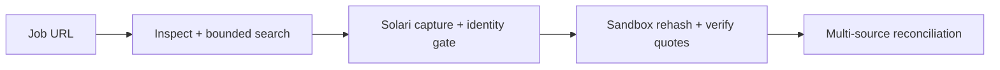

# RoleTruth

[](https://github.com/marcusmayo/roletruth/actions/workflows/ci.yml)
[](LICENSE)
[](https://docs.getsolari.com/)
[](https://codespaces.new/marcusmayo/roletruth)

RoleTruth turns job-post URLs, screenshots, and recruiter clarifications into an
auditable answer to a narrow question: **what does the role actually say?**

It is not a candidate scorer or a universal job summarizer. It resolves atomic
role terms as **Confirmed**, **Conflicted**, or **Unknown**, exposes the exact
source span behind every accepted conclusion, and labels derived math so a
scenario cannot masquerade as quoted compensation.

> The reviewed hiring-post demo works without credentials. A server-side
> `SOLARI_API_KEY` is required to analyze any new URL or screenshot. A URL-only
> run uses a recorded Solari Browser to search for matching public sources,
> captures the underlying pages, and finishes by verifying and reconciling the
> sealed evidence in a Solari Sandbox.


## What a live analysis does

The visible frontend supports three live intake shapes:

- **URL only:** enter one exact job-post URL. RoleTruth inspects its structured
  data, URL slug, and stable job ID; runs bounded public-web searches in the
  same Solari Browser session; and captures matching alternate sources.
- **URL + screenshots:** enter a public job-post URL, attach supporting
  screenshots if useful, then select **Search & reconcile evidence**.
- **Screenshot only:** leave the URL blank, attach one or more job-post or
  recruiter-message screenshots, then select **Search & reconcile evidence**.

Solari does not expose a separate search endpoint. RoleTruth uses its standard
recorded Browser as the search executor: it opens a public search provider,
screens result links, and then opens the selected underlying pages. Search
titles and snippets are discovery leads only and can never support a finding.
For each submitted or discovered URL, the Browser captures the final URL, HTTP
status, page title, first heading, visible body text, full-page image, and any
schema.org `JobPosting` JSON-LD. For screenshot sources, the Node server runs
English OCR with Tesseract.js.

Before a discovered page becomes eligible, it must match the starting opening
by stable job ID or by strict role-and-company identity. Different openings,
multi-job result pages, duplicate content, blocked pages, and company-only
context remain visible but cannot vote. The deterministic extractor then
proposes fields such as company, role, location, work mode, compensation,
employment type, experience, education, duration, materials, and deadline.

Every source image and text receipt is uploaded to an ephemeral Solari Sandbox.
The Sandbox independently re-hashes both artifacts and accepts a candidate only
when its exact supporting quote occurs in the sealed source text. It then
applies the Confirmed / Conflicted / Unknown rules and returns a source-specific
report title, findings, diagnostics, questions, and runtime receipts.

Changing the URL or staged files clears the prior live result. A new report is
not displayed until the new run completes.



## Source quality is part of the result

RoleTruth does not treat every rendered page as job evidence.

| Source state | Meaning | Treatment |
|---|---|---|
| **Usable** | Job structure or reliable role-description signals were captured | Eligible for exact-span extraction |
| **Blocked** | A bot challenge, access-denied page, HTTP 403, or HTTP 429 was captured | Visible in the manifest, excluded from conclusions |
| **Sign-in required** | The source redirected to an authentication or account wall | Excluded; add screenshots or a public direct source |
| **Company context** | The page describes the employer rather than a specific opening | Company may be retained as context; role terms are excluded |
| **Not a job post** | No reliable job-post structure or role-description signals were found | Excluded from role conclusions |
| **Different opening** | A discovered page does not match the same role/company or stable job ID | Retained as a rejected lead; never merged |
| **Duplicate** | The sealed text is identical to an already captured usable source | Excluded so mirrors do not become extra votes |
| **Unreadable** | The page or OCR output did not contain enough readable text | Excluded and surfaced for replacement |
| **Failed** | Browser acquisition, OCR, or integrity verification failed | Excluded with a diagnostic |

A report is labeled **complete** only when every supplied source is usable,
**partial** when usable evidence is reconciled alongside excluded sources, and
**insufficient** when no usable source supplies role terms.

## Judge the reviewed demo in 90 seconds

1. Open the frontend. The reviewed Solari hiring fixture is already loaded.
2. Select **Work mode** and inspect the direct-source quote, capture time, and
   SHA-256 receipt.
3. Select **Actual paid total**. RoleTruth abstains because annualized pay does
   not establish term or full-time equivalency.
4. Select **3-month full-time scenario**. The formula is visible and labeled as
   a scenario—not a promised payout.
5. Turn on **Inject test conflict**. A clearly labeled synthetic onsite claim
   changes only Work mode from Confirmed to Conflicted.
6. Export the evidence JSON or copy the questions that close the remaining
   gaps.

The keyless path is a deterministic fixture, not a simulated live Solari run.
The interface names the current execution mode and does not silently fall back
after a live failure.

## Golden-fixture results

The built-in evidence is the public hiring material that motivated this build.

| Atomic claim | RoleTruth result | Why |
|---|---|---|
| Company | **Confirmed — Pinetree Research** | Direct hiring material |
| Role | **Confirmed — SWE intern** | Explicit opening sentence |
| Work mode | **Confirmed — Remote** | Direct FAQ says it is a remote role |
| Relocation | **Confirmed — Not required** | Same direct FAQ answers the SF/relocation question |
| Compensation basis | **Confirmed — $300,000 annualized** | “Annualized” is preserved as the basis |
| 3-month full-time scenario | **Calculated — $75,000** | $300,000 × 3/12 × 1.0 FTE |
| Actual paid total | **Unknown** | Actual duration and FTE are not established |
| Duration | **Unknown** | A conditional three-month example is not the actual term |
| Employment classification | **Unknown** | Employee/contractor and schedule are unstated |
| Application materials | **Confirmed — résumé, cover letter, and grades not requested** | Explicit direct statement |
| Application path | **Confirmed — fork, build, publish, post, tag** | Numbered steps in the hiring post |
| Deadline | **Confirmed — no fixed deadline** | Direct FAQ explicitly answers “No” |
| Evaluation signal | **Confirmed — genuine problem and user demand** | Direct use-case guidance |

The reviewed screenshots and excerpts are in
[`public/evidence`](public/evidence). They prove the fixed demo only; they are
not evidence that every live page or screenshot can be extracted.

## Why Solari is material

- **Solari Browser** renders public URL sources, records the session, follows
  redirects, executes bounded public-web searches, captures candidate page text
  and full-page images, and exposes structured `JobPosting` data when a page
  publishes it.
- **Solari Sandbox** receives the actual captured/uploaded image bytes plus the
  sealed text manifest, verifies their SHA-256 receipts, rejects unsupported
  quote proposals, and runs the deterministic reconciler in isolation.

The application uses deterministic JSON-LD and English text patterns; it does
not claim a multimodal semantic model or universal extraction. The extractor
can propose evidence, but only the Sandbox verifier can admit an exact span and
only the reconciler can assign a verdict.

The discovery workflow is agentic but deliberately bounded. Solari supplies
the Browser and Sandbox infrastructure, not an LLM or dedicated search API.
With only `SOLARI_API_KEY`, RoleTruth deterministically creates at most three
identity-preserving queries and captures at most four discovered candidates.
An optional model is not required and no model output is treated as evidence.

### Two honest execution modes

| Mode | Credentials | What it proves |
|---|---|---|
| **Reproducible demo** | None | Reviewed source manifest, exact spans, deterministic verdicts, conflict mutation, compensation math, report export |
| **Solari live** | `SOLARI_API_KEY` | URL-only discovery, dynamic URL and/or screenshot intake, Browser receipts, OCR, identity and source-quality gates, Sandbox integrity verification, and live multi-source findings |

Signed replay, CDP, WebSocket, and file capability URLs are not exported.

## Evidence contract

- **RT-R1 · Confirmed:** at least one eligible, integrity-verified, explicit
  assertion exists and every other eligible assertion is compatible.
- **RT-R2 · Conflicted:** eligible assertions are materially incompatible.
  Source authority remains visible but cannot erase a contradiction.
- **RT-R3 · Unknown:** no eligible explicit assertion exists, capture failed,
  the source is unusable, or wording is ambiguous.
- **RT-C1 · Calculated:** formula, inputs, evidence, and assumptions are visible.

Absence is never negative evidence. A duplicated repost is not independent
corroboration. Annualized compensation and a prorated scenario are separate
facts, not competing numbers. See the
[Evidence model](docs/EVIDENCE_MODEL.md) for the entities and normalization
rules.

## Run the visible frontend in Codespaces

1. Open the repository in Codespaces from the badge above, or select
   **Code → Codespaces → Create codespace on main**.
2. If the Codespace already existed before the latest change, update it and
   restart the managed preview:

   ```bash
   git pull --ff-only origin main
   bash scripts/start-codespaces-preview.sh
   ```

3. Open the forwarded **RoleTruth frontend** on port **3000**. If it does not
   open automatically, use the **Ports** tab and select **Open in Browser** for
   port 3000.
4. The reviewed demo is immediately usable without a key.

### Enable live URL and screenshot analysis

1. In the repository or Codespaces settings, create a secret named
   `SOLARI_API_KEY`. Do not commit it and do not prefix it with `NEXT_PUBLIC_`.
2. Stop and restart the Codespace so GitHub injects a newly created secret.
3. Verify presence without printing the credential:

   ```bash
   node -e 'console.log(process.env.SOLARI_API_KEY ? "Codespaces secret: present" : "Codespaces secret: missing")'
   curl -fsS http://127.0.0.1:3000/api/solari/status
   ```

   Expected output is `Codespaces secret: present` and
   `{"configured":true}`. If those disagree, run
   `bash scripts/start-codespaces-preview.sh` again.
4. For a screenshot-only run, leave the URL blank, attach a screenshot of the
   actual job listing or recruiter message, and select **Analyze evidence**.
5. For a URL-only run, enter the exact job-post URL and select **Search &
   reconcile evidence**. Screenshots are optional. The **Evidence ledger**
   exposes every query, screened/captured count, discovered source, identity
   match, and exclusion reason. RoleTruth distinguishes a specific opening
   from a search-results page or company profile. Non-specific URLs receive
   corrective guidance instead of being broadened into unrelated openings. If
   the starting page is blocked, tightly matching job-page leads may be
   captured, but they must still pass the post-capture same-opening identity
   gate before any claim can vote.
6. For a combined run, enter the actual job-post URL, add supporting
   screenshots, and select **Search & reconcile evidence** once.

The web UI accepts one URL plus screenshots. The API supports at most three
URLs, eight total sources, 6 MB per screenshot, and 20 MB of screenshot data per
run. Supported images are PNG, JPEG, and WebP.

### OCR first-run behavior

Screenshot OCR runs server-side through Tesseract.js. The first screenshot run
in a fresh Codespace must initialize the OCR worker and obtain/cache its English
language assets, so it can take materially longer than later runs. The cache is
stored under `/tmp/roletruth-tesseract-cache` and can disappear when the
Codespace is rebuilt or stopped. Keep outbound access available during that
first run. Low-confidence OCR is surfaced in source diagnostics and should be
checked against the visible screenshot before relying on a quotation.

### Free plan and blocked-site fallback

RoleTruth defaults to `recording: true` on a standard Solari Browser session.
That is compatible with the [Solari Free plan](https://docs.getsolari.com/pricing),
which includes three concurrent browsers, one concurrent Sandbox/VM, one-hour
maximum sessions, and one-day browser replay retention. Free does not include
stealth, proxies, or captcha solving.

Leave `SOLARI_BROWSER_STEALTH` unset on Free. A defended source such as
Glassdoor or LinkedIn may return a bot challenge or sign-in wall. RoleTruth
labels that starting source **Blocked** or **Sign-in required**, then continues
bounded discovery for public employer or mirror pages. If it cannot prove the
same job identity, it abstains and asks for the exact role or a listing
screenshot. Solari recommends stealth for defended sites, while standard mode
is intended for ordinary public pages and search. See
[Solari stealth guidance](https://docs.getsolari.com/stealth).

On an entitled plan, stealth remains an explicit operator choice:

```bash
export SOLARI_BROWSER_STEALTH=true
```

Do not enable the flag on Free; a plan-ineligible feature request returns a
deterministic 402. Screenshot-only analysis does not launch a Solari Browser,
but it still requires the key because the evidence is sealed and reconciled in
a Solari Sandbox.

Codespaces deliberately uses the Node-based Next.js development server. The
Solari Browser and Tesseract runtimes cannot execute inside the Cloudflare
workerd process used for the deployable Sites build.

## Dynamic extraction boundaries

RoleTruth first reads schema.org `JobPosting` JSON-LD because it is explicit and
structured. It then applies bounded English patterns to the sealed visible/OCR
text. This handles common representations of role title, company, remote or
hybrid status, location, relocation, salary/rate, duration, employment type,
experience, education, application materials, and deadline.

It deliberately does not infer a claim from general context. Novel phrasing,
poor scans, non-English content, information hidden behind interaction, and
unsupported field types can remain Unknown. A company profile may identify the
company but cannot establish the terms of an opening. A screenshot of a company
overview is therefore not a substitute for the job listing.

## Reconciliation lineage

RoleTruth ports the useful operating patterns from
[`marcusmayo/keel-core`](https://github.com/marcusmayo/keel-core) rather than
depending on an unfinished external service: exact reference first,
deterministic normalization, source-tagged assertions, duplicate exclusion,
collision abstention, and provenance recorded at decision time. Discovery can
propose pages; it cannot mutate the evidence graph or decide a claim. The
Sandbox reconciliation remains deterministic and preserves incompatible values
as **Conflicted** instead of letting authority or search rank silently choose a
winner.

## Verification and pressure-test evidence

The automated gate is:

```bash
npm ci
npm run lint
npm run typecheck
npm test
```

The gate includes dynamic adversarial discovery, extraction, integrity,
reconciliation, and rendered-interface tests. The supplied NIFCO screenshot was
also exercised through real Tesseract OCR (86% confidence), source
classification, extraction, and the same Python verifier used in the Sandbox:
it correctly returns `insufficient`, confirms `NIFCO America Corp` as company
context, and leaves the role unknown.

This build workspace does not have Marcus's Solari credential, so a real remote
Browser/Sandbox run still has to be repeated in the configured Codespace before
the hiring demo is recorded. The table separates automated evidence from that
credentialed release gate:

| Pressure-test case | Release condition | Truthful evidence status |
|---|---|---|
| Reviewed golden fixture and synthetic conflict | Existing conclusions and zero-unsupported-claim invariant remain unchanged | **Automated pass** |
| Accessible public job URL on Free | Dynamic role/company title, usable source, exact quotes, Browser and Sandbox receipts | **Credentialed Codespaces run required** |
| Screenshot-only actual job post | OCR text yields source-linked findings and image/text hashes verify in Sandbox | **OCR/verifier pass; remote Sandbox rerun required** |
| URL plus supporting screenshot | Both sources appear in one report and compatible claims reconcile | **Automated pipeline pass; credentialed combined run required** |
| Defended Glassdoor URL | Bot-detection redirect is labeled Blocked and never treated as eligible evidence | **Exact captured-redirect regression passes; live rerun recommended** |
| URL-only evidence discovery | Queries are bounded; exact job identity is required; snippets are ineligible; duplicates cannot add votes | **Automated discovery and reconciliation tests pass; credentialed live run required** |
| Company-overview screenshot | Company context may be retained, but no role terms are confirmed | **Actual supplied NIFCO screenshot passes locally** |
| Contradictory URL and screenshot | Verified incompatible values become Conflicted with both spans visible | **Automated verifier pass; live visual run required** |
| Invalid/private input | Private URLs, invalid image signatures, oversize files, and excessive source counts are rejected | **Automated pass** |

When a row is exercised, preserve the exported report, browser session ID,
Sandbox ID/exit code, and screenshot of the visible result. Those artifacts are
the evidence for a hiring demonstration; implementation alone is not proof.

## Security and privacy

- Uploaded screenshots are sent to the Codespaces Node server for OCR and then
  uploaded to an ephemeral Solari Sandbox for integrity verification. They are
  not merely staged locally and should not contain unrelated personal data.
- The browser preview for an uploaded screenshot remains a local object URL;
  the API response does not publish a file-capability URL.
- Live URL input accepts public HTTP/HTTPS on ports 80/443 only and rejects
  credentials, localhost, private/loopback/link-local/carrier-grade IPv4,
  local IPv6 ranges, and metadata targets. The same checks run on Browser
  requests and discovered URLs.
- File count, aggregate size, per-file size, and PNG/JPEG/WebP signatures are
  validated server-side.
- Browser, navigation, OCR, Sandbox, and command operations have bounded
  timeouts; Browser and Sandbox resources are cleaned up in `finally` blocks.
- Solari credentials remain server-side.
- Reports exclude replay, CDP, WebSocket, and signed upload/download URLs.
- Source text is untrusted data and cannot alter the deterministic rulebook.
- CSP, frame denial, MIME-sniffing denial, referrer policy, and restrictive
  permissions policy are set.

The full boundary and known gaps are in the
[Threat model](docs/THREAT_MODEL.md).

## Limitations

- OCR is English-first and accuracy depends on screenshot scale, contrast,
  compression, cropping, and layout.
- Dynamic extraction is deterministic and intentionally bounded; it is not a
  multimodal model and does not understand every job-post phrasing.
- Standard Free-plan Browser sessions cannot reliably acquire defended or
  authenticated sites; screenshot fallback is the supported Free path.
- Authenticated portal profiles and email integrations are out of scope.
- RoleTruth reports what captured sources state; it cannot guarantee that a
  company will honor or has not changed those terms.
- Replay availability can lag browser release, and replay URLs expire.
- DNS rebinding requires gateway-level egress enforcement beyond the app's
  pre-navigation URL checks.

## Build-to-apply traceability

| Public requirement | Evidence in this repository | Status |
|---|---|---|
| Build a genuine use case | Reconciles location, pay, requirements, and application ambiguity repeatedly encountered during a real job search | Implemented; live field evidence still required |
| Use Solari Browser, Sandbox, and/or Desktop | Browser acquisition plus Sandbox image/text verification and reconciliation | Implemented; credentialed pressure tests pending |
| Publish publicly | [`marcusmayo/roletruth`](https://github.com/marcusmayo/roletruth) | Complete |
| Make it usable | Visible Codespaces frontend with URL, screenshot-only, and combined intake | Implemented; public hosted Site intentionally disabled |
| Prove people want it | Redacted field-test issue template | **Pending real users; no adoption claimed** |
| Fork the Solari cookbook | This initialized repository is standalone, not marked as a GitHub fork | **Marcus action required** |
| Post and tag Harry/Solari | LinkedIn or X post | **Marcus action required** |

The public [Solari use-case catalog](https://www.getsolari.com/use-cases) and
[cookbook](https://github.com/solari-sdk/solari-cookbook) showed no exact
RoleTruth equivalent when this project was scoped on September 1, 2026. That is
only a public-overlap check; only the Solari/Pinetree team can confirm there is
no private-roadmap overlap.

See the [Submission checklist](docs/SUBMISSION_CHECKLIST.md) for the remaining
human-owned steps.

## AI-assisted build disclosure

This project was deliberately built with AI assistance, as the hiring post
requested. Product boundaries, evidence rules, source interpretation, security
controls, code, tests, and documentation were reviewed against the supplied
evidence. No user adoption, successful execution of an unrun dynamic case,
private-roadmap clearance, or fork status has been fabricated.

## License

[MIT](LICENSE)
